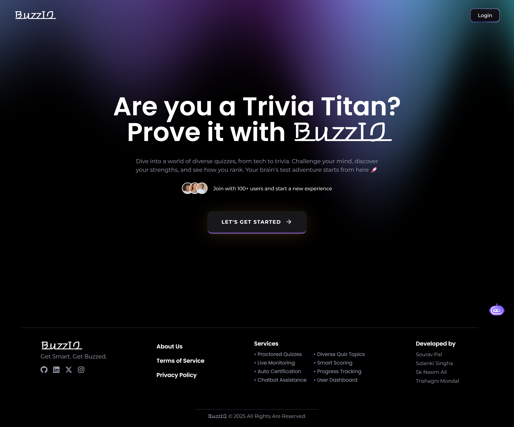

# BuzzIQ 

**BuzzIQ** is a smart and secure online quiz platform designed to offer a fair, engaging, and performance-driven assessment experience. It ensures real-time monitoring, auto-certification, and a dedicated user dashboard, all while prioritizing user privacy and data security.

## Screenshot

&nbsp;

## 🚀 Features
- Online proctored quizzes
- Live monitoring during assessments
- Smart scoring system
- Auto-generated certificates (for scores >= 65%)
- Subject-wise quiz topics 
- Performance tracking via user dashboard
- Chatbot for app-related assistance 
- Result-based certificate download
- Local storage–based user rating system 

## 🛠️ Technology Used

### Frontend
- Vite + React.js
- Tailwind CSS
- Clerk  

### Backend
- Express.js
- MongoDB

## 🧾 How to Run the Project
1. Clone the repository
2. Run `npm install` in both frontend and backend directories
3. Set up environment variables (see below)
4. Run the development server using `npm run dev` or respective command for frontend/backend

## 🔐 .env for frontend
- `VITE_CLERK_PUBLISHABLE_KEY`
- `VITE_API_BASE_URL=http://localhost:5000`

## 🔐 .env for backend
- `PORT=5000`
- `MONGODB_URI=your_mongo_uri`

## 🧭 Pages Overview
- **Home Page** – Introduction to BuzzIQ and chatbot access
- **Quiz Dashboard** – Displays available topics and quiz navigation
- **Quiz Page** – Main quiz interface with live monitoring
- **Result Page** – Displays score, download certificate (if eligible), and a rating system
  

## 📌 Future Enhancements
- Leaderboard & Global Rankings
- Admin Panel for uploading quizzes
- AI-generated questions (GPT integration)

### 👨‍💻 Developers
- [Sourav Pal](www.linkedin.com/in/souravpal18)
- [Solanki singha]()
- [SK Nasim Ali]()

## License
This project is licensed under the **[MIT License](https://choosealicense.com/licenses/mit/)**. See the LICENSE file for more details.
